# Making Embedded Systems

## Final Report

## Sam Ettinger, Orange Stars Cohort, June 2022

[\
Project video: https://youtu.be/2f6550TF2GQ](https://youtu.be/2f6550TF2GQ "MES Project video")

[Projective Set code repository: https://github.com/settinger/MES_Projective_Set](https://github.com/settinger/MES_Projective_Set)

[3D Azulejo Controller code repository: https://github.com/settinger/MES_3D_Controller](https://github.com/settinger/MES_3D_Controller)

---

For various reasons, I had a difficult time anticipating what hardware I would be able to acquire and familiarize myself with in time for a meaningful project. Consequently I aimed to rely as much as possible on the class board, the STM32F429I-DISC1, and its built-in peripherals. However, this left me dissatisfied with the scope of any single project idea I could come up with. To remedy this, I implemented two projects, with a shared theme of providing quick, satisfying mental activity.

## Project 1: Projective Set

Project 1 is a portable implementation of the game [Projective Set](<https://en.wikipedia.org/wiki/Projective_Set_(game)>). In this game, seven cards are dealt out, each with some number of different-color dots:

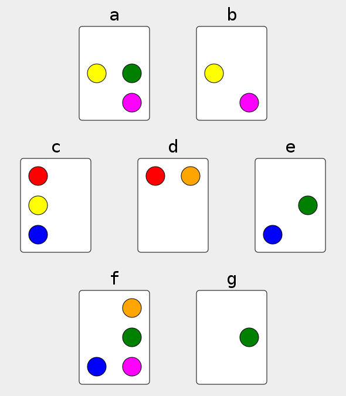

The objetive is to find a "set," defined as any number of cards such that there is an even number of each color dot. For example, in the above diagram, A-B-G form a set, as they combine to have 2 yellow, 2 green, 2 magenta, 0 red, 0 orange, and 0 blue dots. B-C-D-F-G also forms a set, because there are 2 of each color. A third set exists: A-C-D-F, the exclusive disjoint set of A-B-G and B-C-D-F-G. The best way to get a feel for the rules is to play it; [here is a web-based version to play around with](https://www.settinger.net/projects/proset/prosetJS/).

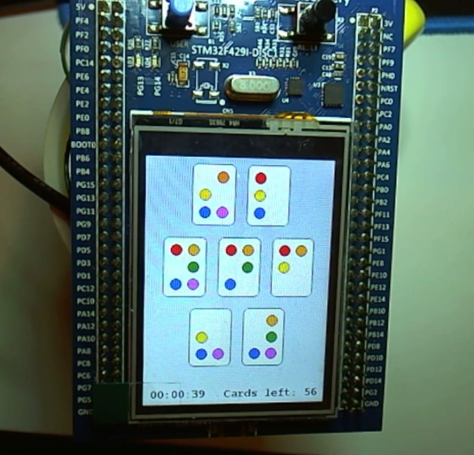

The board is displayed on the STM32F429I-DISC1 LCD and can be interacted with using the touch screen or through a serial terminal. In addition to the 6-dot mode of play shown above, this project implements 4- and 5-dot modes (for fewer cards and easier game play) as well as 7- and 8-dot modes (for exponentially more difficult gameplay).

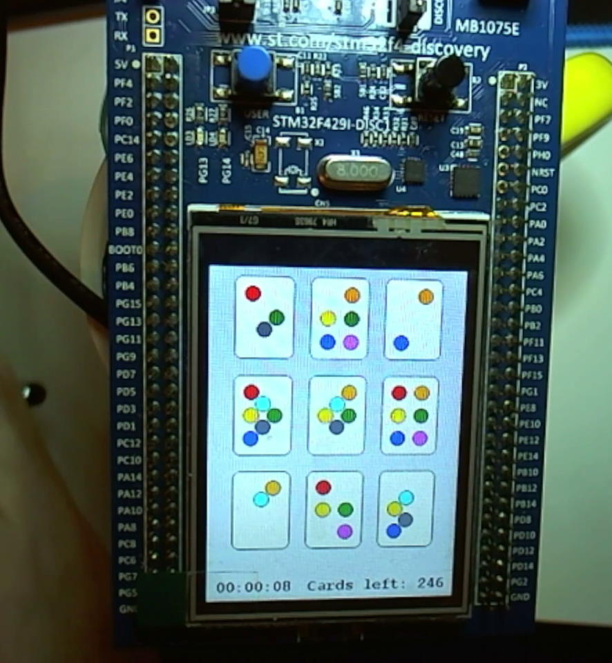

---

## Project 2: 3D Azulejo Controller

Project 2 is a controller for painting symmetrical patterns on a spherical surface. This is an experiment in taking the two-dimensional _azulejo_ pattern of repeating tiles with specific symmetry:

<small><i>Detail from a photo by <a href="https://unsplash.com/@jeancarloemer?utm_source=unsplash&utm_medium=referral&utm_content=creditCopyText">Jean Carlo Emer</a> on <a href="https://unsplash.com/?utm_source=unsplash&utm_medium=referral&utm_content=creditCopyText">Unsplash</a></i></small>

Drawing such a pattern in two dimensions is straightforward enough; what would a three-dimensional version look like? To answer this, I turned the STM32F429I-DISC1 into a pointing device for painting on a sphere in 3D space.

A serial communication port is opened between the STM32F429I-DISC1 and a webpage running the [a Web Serial program](https://developer.mozilla.org/en-US/docs/Web/API/Web_Serial_API). The STM32F429I-DISC1 tracks its own position using the on-board gyroscope and an LIS2DH accelerometer glued to the back. This position data (along with button settings, color and size preferences) is transmitted over serial and used to draw on the surface of a sphere in a webpage. The cursor size and color can be set via the touchscreen.

## Hardware

For both projects, the STM32F429I-DISC1 development board was used as the core of the hardware. Both projects rely on the on-board LCD and its touch responsiveness. The LCD display is driven by the [ILI9341](https://cdn-shop.adafruit.com/datasheets/ILI9341.pdf) driver chip, which communicates with the STM32F429 over SPI; the touch control is driven by the [STMPE811](https://media.digikey.com/pdf/Data%20Sheets/ST%20Microelectronics%20PDFS/STMPE811.pdf) which communicates with the STM32F429 over I2C. Both devices are accessed through drivers and a hardware abstraction layer provided by ST.

Both projects also rely on the development board's SPST button, which is read from a simple GPIO pin.

Both projects use a UART to communicate with a PC over serial. A generic USB-to-TTL is connected to the development board for this purpose. Projective Set requires two-way serial communication but the 3D Azulejo Controller only transmits data. This UART is accessed through a hardware abstraction layer from ST.

For Projective Set, a user setting needs to be stored between sessions, which would be a good use case for EEPROM. The development board does not have any EEPROM hardware, but that hardware is emulated by the STM32F429 by repurposing the last page of Flash memory.

For the 3D Azulejo Controller, orientation sensing is achieved with the on-board [I3G4250D](https://www.st.com/resource/en/datasheet/i3g4250d.pdf) gyroscope and an external [LIS2DH](https://www.st.com/resource/en/datasheet/lis2dh.pdf) accelerometer breakout attached to the development board. Both devices communicate over SPI via a hardware abstraction layer and drivers from ST.

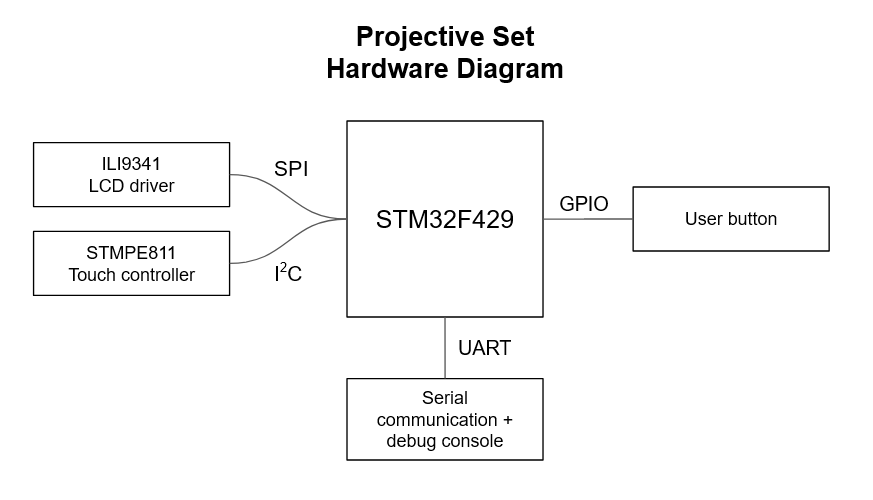

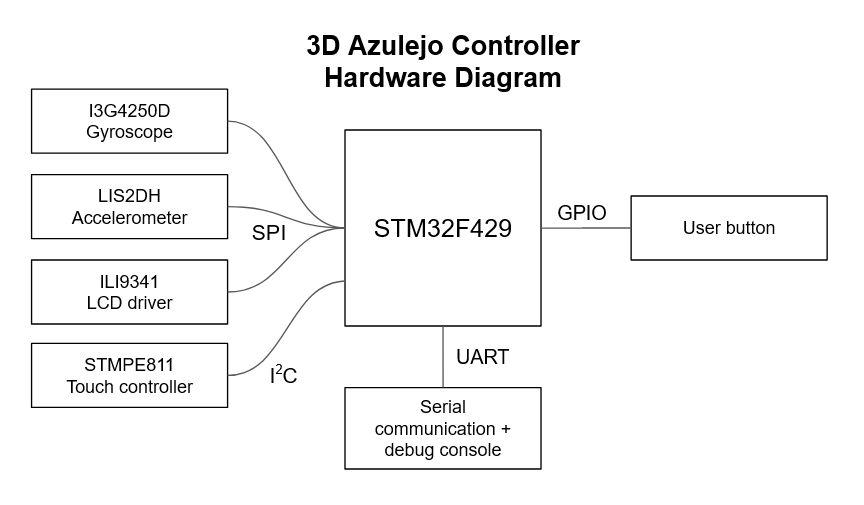

## Software

The code for the projects was generated in STM32CubeIDE. The repositories are on GitHub: [Projective Set here](https://github.com/settinger/MES_Projective_Set), [3D Azulejo Controller here](https://github.com/settinger/MES_3D_Controller).

### **ST software modules and licenses**

1. The hardware abstraction layer modules for the STM32F42xx are not included directly in the repositories above. Instead, it is referenced directly from the [STM32CubeF4 series libraries](https://github.com/STMicroelectronics/STM32CubeF4) that were included in my installation of STM32CubeIDE. These are used under the license agreement provided when installing STM32CubeIDE.
1. The CMSIS math libraries used in the 3D Azulejo Controller project are linked to in the same manner as the HAL modules. These are licensed by ARM Limited under an [Apache License 2.0](https://www.apache.org/licenses/LICENSE-2.0).
1. The Board Support Package (BSP) drivers for the STM32F429I-DISC1 are supplied by ST but are included directly in the repositories. These drivers are used to interface with the LCD and touch screen in both projects, as well as the gyroscope and accelerometer in the 3D Azulejo controller. These are licensed by ST under the [BSD 3-Clause License](https://opensource.org/licenses/BSD-3-Clause).
1. The library used to configure the LIS2DH accelerometer is provided by ST under the [BSD 3-Clause License](https://opensource.org/licenses/BSD-3-Clause).
1. The EEPROM Emulation used in the Projective Set project is lightly modified from the library in the STM32CubeIDE example project called `EEPROM_Emulation`. It is licensed with a general "AS-IS" license.
1. The font libraries used in Projective Set are direct from ST as well, and included in the `/Utilities/` folder. These libraries are licensed from ST with [a general "AS-IS" license](https://github.com/STMicroelectronics/STM32CubeF4/blob/master/Utilities/Fonts/Release_Notes.html). A slight alteration was made to generate a narrower monospace font for the Projective Set project.
1. The STM32 USB Host Library and STM32 USB Device Library are unused, but included in the 3D Azulejo Controller project to motivate me to turn the controller into a USB HID input device soon. These libraries are licensed by ST with [SLA0044, the "Ultimate Liberty Software License Agreement"](https://www.st.com/content/ccc/resource/legal/legal_agreement/license_agreement/group0/87/0c/3d/ad/0a/ba/44/26/DM00216740/files/DM00216740.pdf/jcr:content/translations/en.DM00216740.pdf).

### **Software modules and licenses from other sources**

1. A Kalman filter was implemented to calculate Euler angles from the fused gyroscope and accelerometer readings. This filter library was largely derived from the [MPU6050 library by Konstantin Bulanov](https://github.com/leech001/MPU6050) which is licensed with a [GNU GPL v3 license](https://www.gnu.org/licenses/gpl-3.0.en.html). That library itself is derived from the [C++ Kalman Filter library by Kristian Lauszus](https://github.com/TKJElectronics/KalmanFilter) which is licensed with a [GNU GPL v2 license](https://www.gnu.org/licenses/old-licenses/gpl-2.0.en.html). The MPU6050 filter was changed to (1) read from the on-board I3G4250D gyroscope and the external LIS2DH accelerometer, (2) use `float` instead of `double` in the math, (3) rearrange which axes are aligned with which directions in the body frame and the inertial frame.
1. To create the 3D graphics used on the 3D Azulejo Controller web client, I used [three.js](https://threejs.org/) which is licensed under an [MIT License](https://github.com/mrdoob/three.js/blob/dev/LICENSE).

### **Software written by me for these projects**

1. **Projective Set console:**
   The serial console used in Projective Set is derived from the in-class assignment to generate a console with commands. However, instead of instructing the buffer to wait for a null character or endline character, it has been altered to respond to individual keystrokes. For example, typing the numeral '1', without hitting enter, immediately activates the card in the first spot on the board. This adjustment allowed the console to be used for testing and for keyboard control of the finished game.

1. **3D Azulejo Controller console:**
   The serial console used for the 3D Azulejo Controller was greatly simplified by virtue of being transmit-only. The board transmits one- or two-parameter instructions that are received and interpreted by a webpage running the experimental [Web Serial API](https://developer.mozilla.org/en-US/docs/Web/API/Web_Serial_API), which processes the instruction with a Javascript program. <!-- TODO: link to the section of the writeup about the Javascript program -->

1. **Projective Set game engine and graphics:**
   The main loop of the Projective Set program runs at 50 frames per second. On each frame, the program checks for new inputs from the touch screen, console, and SPST button, then adjusts its internal state and/or graphics accordingly. The graphics represent the current state of the playing field, a timer, and how many cards are left in the deck.

1. **3D Azulejo Controller main program and graphics:**
   The main loop of the 3D Azulejo Controller program runs at 40 frames per second. On each frame, the program takes sensor readings, adjusts the Kalman filter to generate estimated Euler angles, and transmits those Euler angles via serial UART. In addition, the program checks for inputs from the touch screen, console, and SPST button, and accordingly adjusts its serial outputs and internal state. The graphics either direct the user to a small color palette selection screen or to a pen-size adjustment screen.

1. **LIS2DH accelerometer interface:**
   While the LIS2DH accelerometer could be controlled entirely through the ST-provided driver, it was streamlined by writing a library to encapsulate the key functions such as providing the initial configurations, enabling/disabling interrupts, and SPI configuration. Much of this code was structurally based on [an example from ST](https://github.com/STMicroelectronics/STMems_Standard_C_drivers/blob/master/lis2dh_STdC/examples/lis2dh_read_data_polling.c).

## Architecture

Both projects run as loops updating every 20-25 milliseconds. On each iteration of the loop after booting up, the programs check the current program state, then check for any inputs from the user, then perform any necessary graphics updates, console transmissions, and internal state adjustments, then wait for the next 20-25 ms period to elapse.

In Projective Set, those user inputs take the form of screen touches, short medium or long button presses, and console keypresses. When in the GAME_IN_PLAY state, these inputs mostly affect the `table` variable, which contains information about the current play area such as which cards are currently selected. When in the LEVEL_SELECT state, these inputs can lead to writing to the emulated EEPROM and changing the actual gameplay. To do all this effectively, the Projective Set software includes modules for manipulating the `table` structure, the associated `deck` structure, checking win conditions, keeping track of time, processing different inputs, and handling the various state transitions.

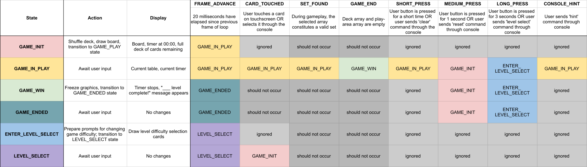

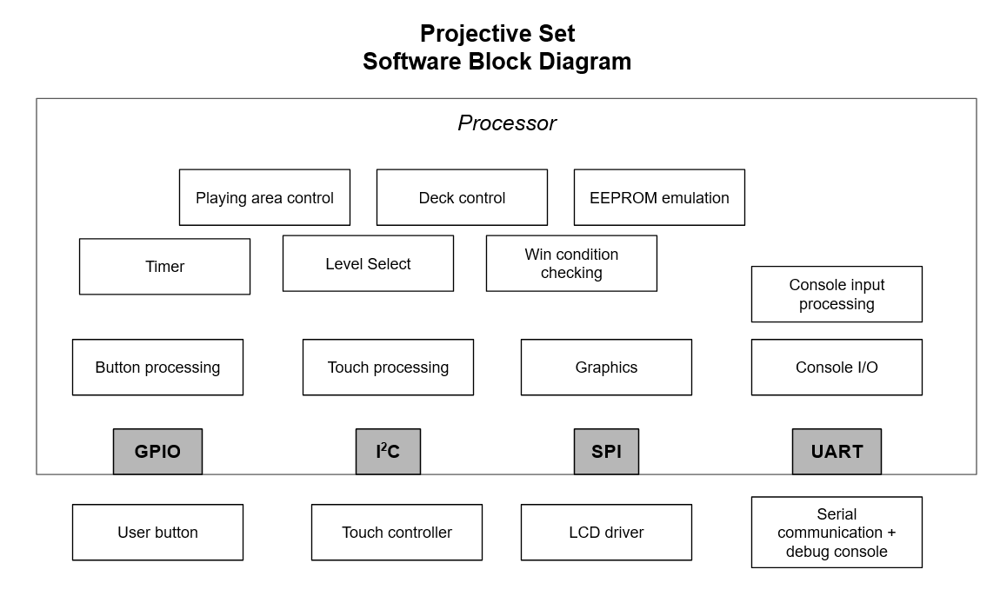

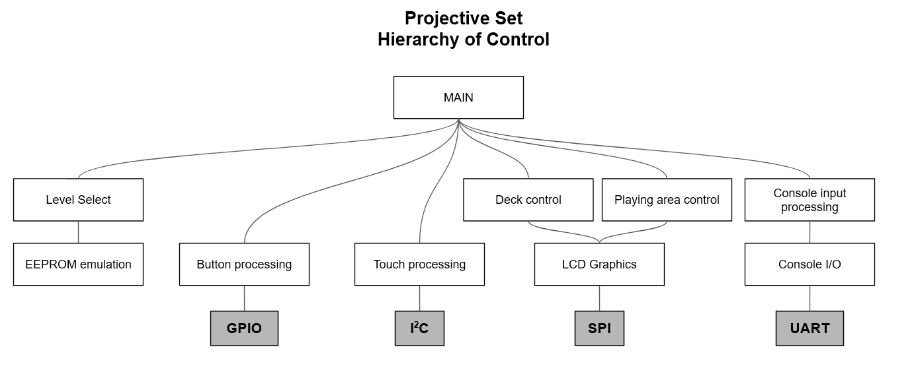

In the 3D Azulejo Controller program, the primary input is the sensor data from the accelerometer and gyroscope, which are processed to generate the critical state variables `theta` and `phi`. This is done constantly and persistently regardless of user behavior. The primary _user-controlled_ input is the SPST button, but the touchscreen is also utilized for the user to manipulate the color and size of the 3D cursor. It is necessary for the STM32 to handle the sensor readings, fusing them into state variables, combining that information with information gathered from the latest user inputs, delivering that information over a serial communication line, and handling any graphical changes that may arise. At the same time, it is necessary for the web client to handle receiving serial information, parsing it, and delivering a useful 3D graphical representation to the user.

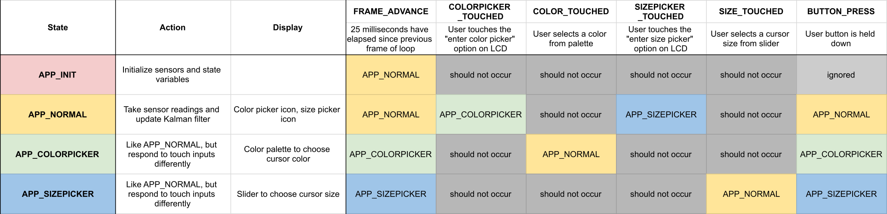

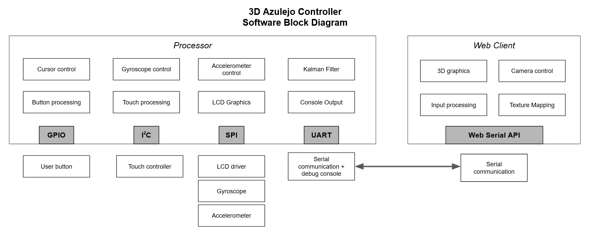

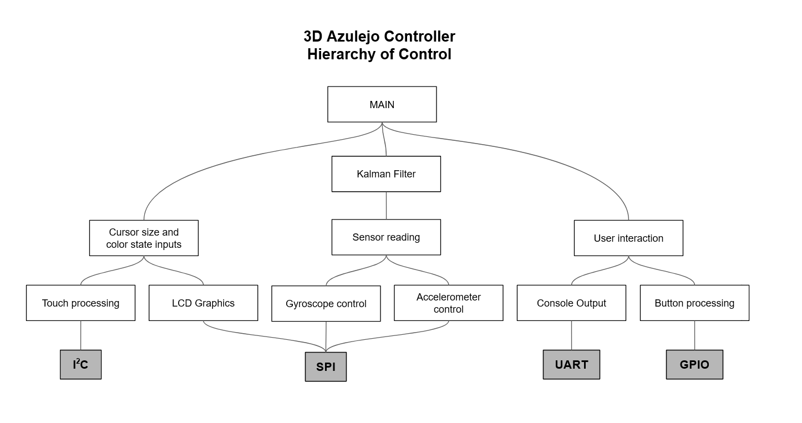

In addition to the project's state machines, the touch detection system uses a small state machine of its own to debounce touches. This filters out mis-fires where a touch is briefly detected when one is not occurring, or a touch is not detected when one is occurring. This prevents the "touch begun" events from firing multiple times. In essence, the touch controller waits for four consecutive inputs of the same touch state before the program can transition to a different touched/untouched behavior.

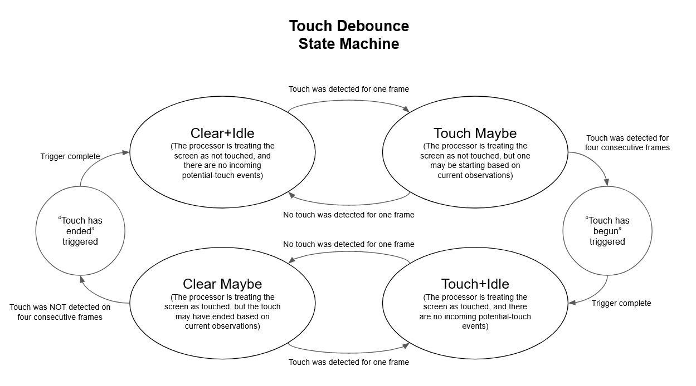

## Build instructions

### **Toolchains**

Both projects were built and tested in the STM32CubeIDE program. STM32CubeIDE comes installed with some common libraries and the option to download others. Rather than copy-pasting these libraries into every project that uses them, it is possible to link each one from its central location in the STM32Cube installation to each individual project. However, this does mean that, when building the project on a new machine, it requires re-configuring the expected paths.

For example, if the current repository is cloned to a new machine, the GCC compiler's include paths look like this:

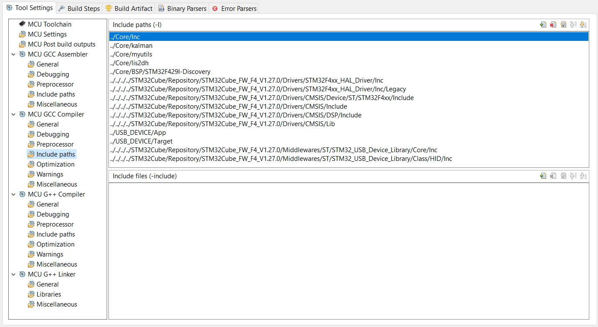

The `../../../../` at the start of some of the paths indicates that the project is using _relative paths_ to look four directories up for the relevant STM32Cube libraries. If this is not where they are located on the new machine, these paths will have to be altered accordingly. The paths can be _absolute paths_ if the project is not being developed on multiple machines with different installation configurations.

The [Web Serial API](https://developer.mozilla.org/en-US/docs/Web/API/Web_Serial_API) does not require a toolchain to build, per se, but it requires a web server to run it, and it must be run in Chrome (as of this time). In development I used the [Live Server extension for Visual Studio Code](https://marketplace.visualstudio.com/items?itemName=ritwickdey.LiveServer) to run a local server. An alternative would be to use the version I am hosting at [azulej.io/experiments/3d/](https://azulej.io/experiments/3d/), but I admit I am not confident that it will work for everyone.

### **Hardware**

Projective Set does not require any peripherals to play, just the STM32F429I-DISC1 itself. It benefits from being connected to a computer terminal for serial console input, which is done on the UART line `UART5`. The 3D Azulejo Controller requires that UART serial console, as well as an LIS2DH accelerometer connected to the SPI bus `SPI5`.

The orientation of the accelerometer matters greatly—the board expects it to be attached to the reverse face of the STM32F429I-DISC1 and oriented like so:

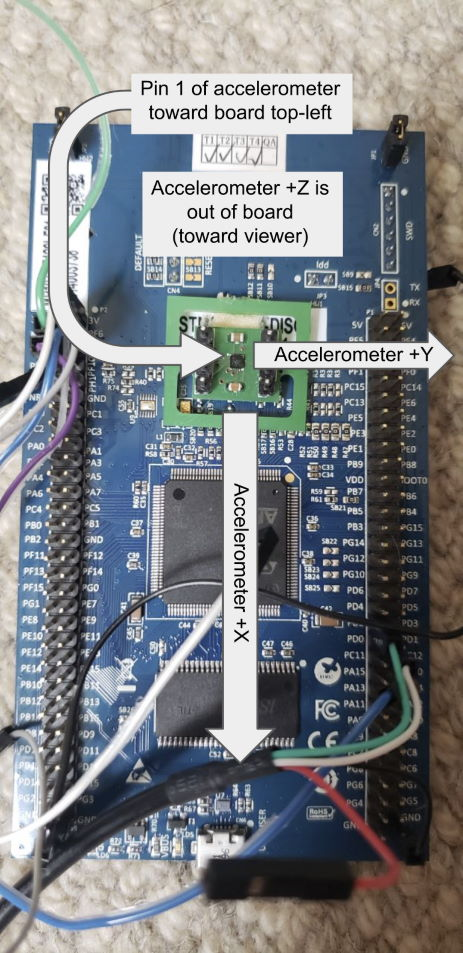

The connections for `UART5` and `SPI5` are as follows:

| Peripheral | Signal | Pin  | Description                                    |
| ---------- | ------ | ---- | ---------------------------------------------- |
| UART5      | TX     | PC12 | Data _from_ computer _to_ STM32                |
| UART5      | RX     | PD2  | Data _to_ computer _from_ STM32                |
| SPI5       | CS     | PF6  | SPI chip select for accelerometer (active low) |
| SPI5       | SCK    | PF7  | SPI clock signal                               |
| SPI5       | MISO   | PF8  | SPI data _to_ sensor _from_ STM32              |
| SPI5       | MOSI   | PF9  | SPI data _from_ sensor _to_ STM32              |

A generic USB-to-TTL cable was used for the serial communication between the STM32 and a computer. In addition to the RX (white) and TX (green) wires, The serial communication was configured for 115200 baud, 8 data bits, 1 stop bit, no flow control, and no parity.

### **Software**

The projects were written in C using the STM32CubeIDE program. Compiling each project _should_ work if the build paths are corrected as described in the "Toolchains" section, above.

The web client for the 3D Azulejo Controller is a small amount of HTML and several Javascript scripts. These were written using Visual Studio Code as an IDE. Running the web client must be done in Chrome, following the instructions in the "Toolchains" section.

### **Debugging and testing**

Debugging and testing was done largely through the STM32F429I-DISC1 inbuilt debugging tools. Stepping through the code one line at a time proved invaluable for getting a clear picture of the inner workings of some of the more complex processes, such as the Kalman filter. Since there was a UART serial console built in to both projects from the beginning, it made sense to use console logging frequently for quick snapshots of the board's behavior around suspect lines of code. Strictly speaking, there are no debug console functions to discuss since they are all part of the intended user experience as well. Being able to manipulate cards in Projective Set through the console was without doubt critical for debugging and finding mistakes in a reasonable amount of time, but remain valuable for gameplay purposes as well.

### **Power**

Both projects are powered by the STM32F429I-DISC1 USB-Mini port, which also provides the board's programming and debugging functionality. On paper, there is no reason why the projects could not be powered by a different power source in the 3.3V to 5V input range, but I have not yet tried. I look forward to having more time to experiment with power consumption and find out what these projects are currently using, as well as how they may be streamlined.

Projective Set is currently based on a 50-fps loop that checks for new inputs and redraws the screen every 20 milliseconds. This is a system that works well for dynamic displays and frequent inputs, but is almost certainly not the most power-efficient method of running a game with very little screen variation and a limited number of inputs. It should be possible to configure each input to trigger an interrupt and cause an update immediately, rather than poll for each input every 20 milliseconds. This would require careful consideration to ensure the interrupts do not interfere with each other, but seems doable in the near future.

The 3D Azulejo Controller is more suited to the steady loop behavior (but running at 40 frames per second instead of 50) since it has to continuously transmit updated information about the state of the sensors and inputs. One easy way to immediately reduce power consumption would be to reduce the frequency with which the sensors take readings. Since the system updates its state and observers only 40 times per second, it is unnecessary to have the gyroscope update 100 times per second and to have the accelerometer update 400 times per second, as is currently the case.

## Looking back, looking forward

It is difficult to look back at the code I was writing at the start of each project without wanting to rip it all up and re-do it with the knowledge I've gained since then. I've developed a practical appreciation for certain naming conventions, design patterns, and folder structures that I wish I had used from the start. If I had the time and energy to go back and polish both projects more, I would incorporate versioning immediately and change the folder structure of my projects.

There are still many new things I'd like to attempt with both projects. I would very much like to configure the 3D Azulejo Controller as a USB mouse peripheral, rather than relying on Web Serial for communicating with a PC. With both projects, I would like to condense them and move from development boards to a compact, purpose-built PCB. In Projective Set, the EEPROM emulation could very easily be supplanted by an actual EEPROM module. There are many additional features that could be added: sound effects and animations to Projective Set, better texture mapping to the Azulejo web client, more sensors for tracking the 3D Controller in full 3D space. The 3D controller uses just 4.5% of the available Flash memory, and Projective Set only 3.8% (and that number goes down if EEPROM emulation is removed and that final page of Flash is freed back up). This means there is plenty of room to both add new features _and_ attempt to use a smaller, more efficient, less capable STM32 microcontroller.

## Appendix: Grading rubric and self-assessment

| Criteria                             | Rating | Comment                                                                                                                                                                                                                                                               |
| ------------------------------------ | ------ | --------------------------------------------------------------------------------------------------------------------------------------------------------------------------------------------------------------------------------------------------------------------- |
| Project meets minimum project goals. | 2      | Limited peripherals, state machine, and console commands.                                                                                                                                                                                                             |
| Completeness of deliverables         | 2.5    | Video explains projects well, but I doubt code is readable on its own (despite my best efforts at my current level of experience).                                                                                                                                    |
| Clear intentions and working code    | 3      | System performs as desired; code can be replaced or swapped out without having to start from scratch.                                                                                                                                                                 |
| Reusing code                         | 2.5    | Code licenses are documented in this report. Some "reused" code had to be rewritten before I could figure out how to use it. I hope others find the systems rebuildable, since I had to rebuild it myself on four different machines over the duration of this class. |
| Originality and scope of goals       | 2.5    | I'm happy with the content but still want to revisit this class with a project idea that (to me) is more engaging.                                                                                                                                                    |
| **Bonus:** Version control           | 3      | I love git                                                                                                                                                                                                                                                            |
