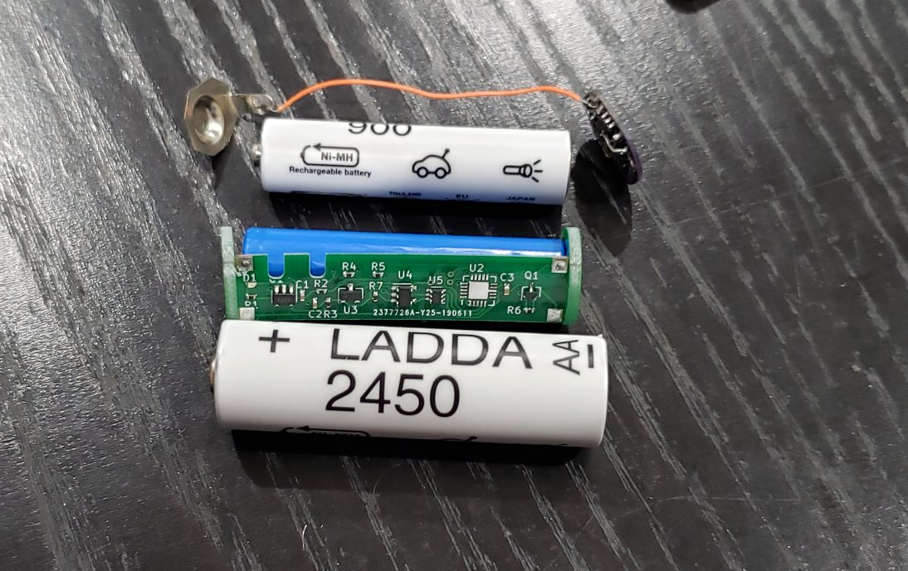
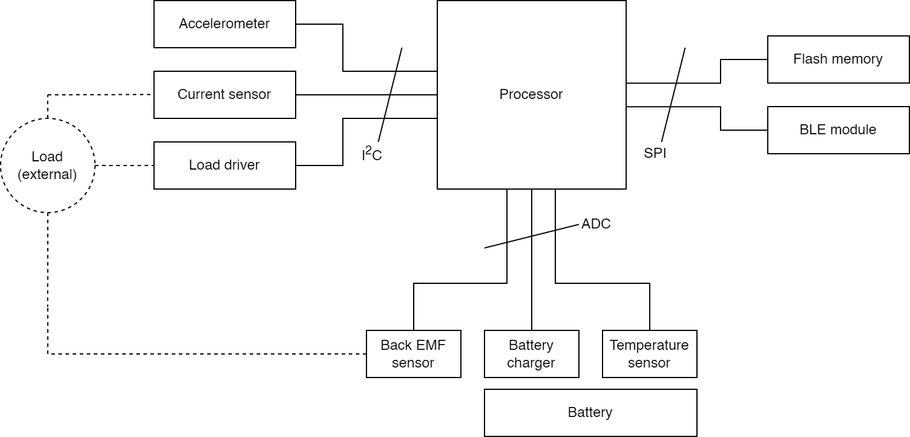
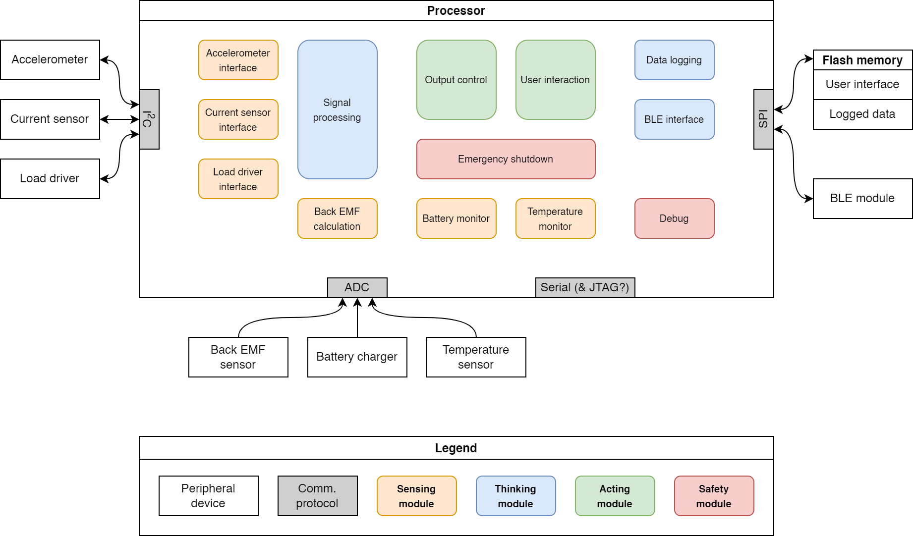
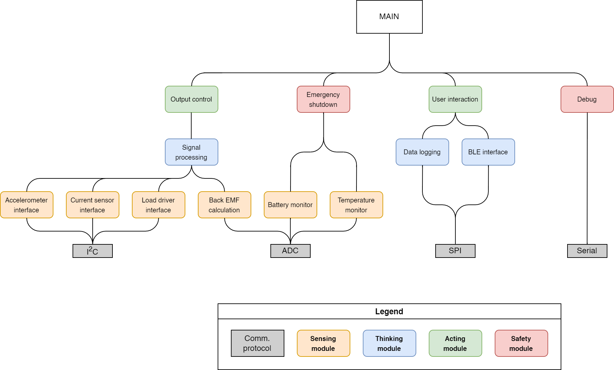

# The IoT AA Battery

## Overview

This embedded system impersonates a AA battery. Most of the time, it sits in a larger circuit and supplies 1.5 V like a AA battery. But it's also collecting data about its environment with a current sensor, an accelerometer, and back-EMF detection for inductive loads like motors. It communicates this information to the user via a BLE module. In addition, the load driver circuitry enables the device to do more than deliver 1.5 VDC; it can adjust the voltage supplied to the external circuit, or deliver a PWM signal, or limit the current supplied. This enables a user to test, monitor, and control a battery-driven circuit with extra sophistication, and without having to modify the existing device.

*Pictured: a AA battery (bottom), a li-ion cell and PCB shaped like a AA battery (middle), a AAA battery and circuit that can be ignored (top).*

This photo is from 2018 and shows a very early (failed) attempt at something shaped like the system described above (but functionally very different). It is here to convey what I mean by "an embedded system in AA form factor".

## Hardware Block Diagram

## Software Block Diagram

## Hierarchy of Control

