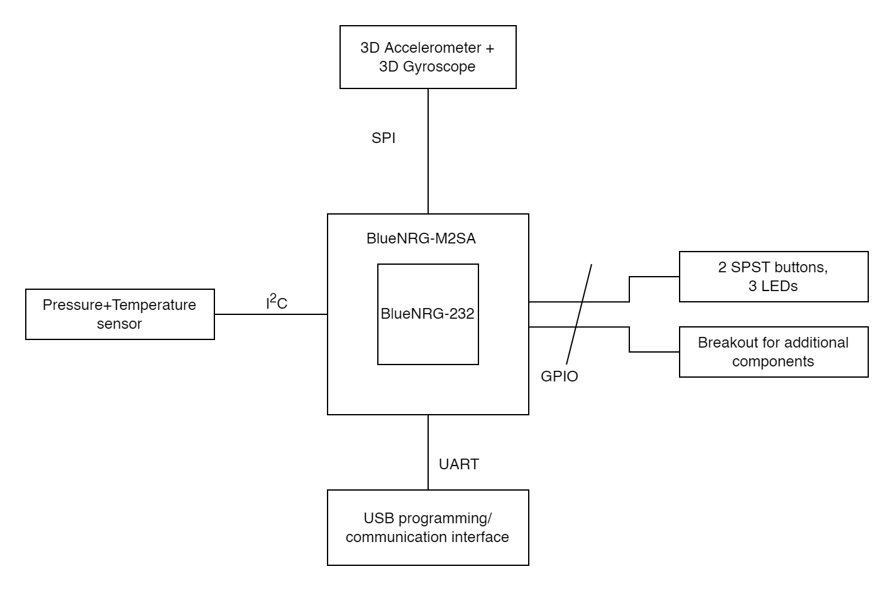
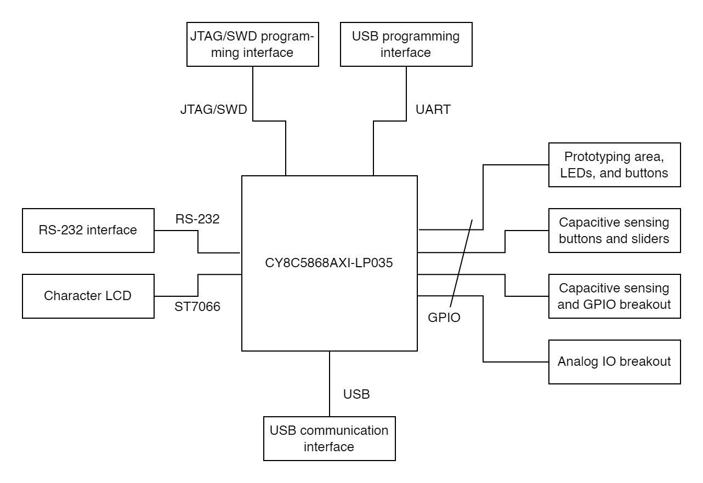

# Investigating Project Boards

## Board 1: `STEVAL-IDB008V1M`
### Processor
The [STEVAL-IDB008V1M](https://www.st.com/en/evaluation-tools/steval-idb008v1m.html) is based on ST's [BlueNRG-M2SA](https://www.st.com/en/wireless-connectivity/bluenrg-m2.html) module, which itself contains a [BlueNRG-232](https://www.st.com/en/wireless-connectivity/bluenrg-2.html) SoC. This is a Cortex-M0 processor with tightly integrated Bluetooth LE functionality.

### Memory
The BlueNRG-2 Processor holds 256 kB Flash and 24 kB RAM. [See section 3.3, "Memories" of the datasheet](https://www.st.com/resource/en/datasheet/bluenrg-2.pdf). There are no other memory types in the processor, and no external memory on the dev board.

### Peripherals
The dev board adds
- [LSM6DS3](https://www.st.com/en/mems-and-sensors/lsm6ds3tr-c.html), a 3D accelerometer and 3D gyroscope, connected over the SPI bus.
- [LPS25HB](https://www.st.com/en/mems-and-sensors/lps25hb.html), a MEMS pressure sensor with embedded temperature sensor, connected with I2C
- [STM32L151CBU6](https://www.st.com/en/microcontrollers-microprocessors/stm32l151cb.html), a Cortex M3 microcontroller programmed to work as a USB-to-UART bridge, connected to the processor with (surprise!) UART.
- 2 SPST buttons and 3 LEDs connected to GPIOs.

Additionally there is space for Arduino-compliant header pins to connect other peripherals.

### ADC
The processor has a 10-bit ADC. There are two dedicated pins, ADC1 and ADC2, which are broken out on the dev board. The ADC can be configured for:
- single-ended operation (reading a voltage from either pin ADC1 or ADC2)
- differential operation (reading the voltage differential between ADC1 and ADC2)
- device voltage reading
- device temperature reading

The maximum sampling rate is 1MHz. The resolution is 10 bits. The processor also has an dedicated digital filter for MEMS microphones connected to the ADC.

### Costs
The dev kit is readily available; it costs US$46.88 on Digi-Key and Mouser, or US$49.95 direct from ST. The M2SA module is unavailable anywhere, but hypothetically costs US$12.49 on Digi-Key and US$11.98 on Mouser. The BlueNRG-2 SoC comes in three different packages:
- The 32-pin QFN is in stock and costs US$4.46 on Digi-Key. This is the package in the dev board.
- The 48-pin QFN is in stock and costs $4.61 on Digi-Key or US$4.12 direct from ST.
- The 34-pin WLCSP is out of stock but hypothetically costs US$3.90 on Digi-Key

### Hardware Block Diagram

### Application Note
I looked at [PCB Design Guidelines](https://www.st.com/resource/en/application_note/an4819-pcb-design-guidelines-for-the-bluenrg1-and-bluenrg2-devices-stmicroelectronics.pdf) because I think eventually I would like to design my own PCB for this chip. I am grateful to have this A/N because antenna design is not something I want to attempt myself.

-------------------------
-------------------------
-------------------------

## Board 2: `CY8CKIT-050`
### Processor 
The [CY8CKIT-050](https://www.infineon.com/cms/en/product/evaluation-boards/cy8ckit-050b/#) is a dev kit for the PSoC-5 ecosystem. It is built around a [CY8C5868AXI-LP035](https://www.infineon.com/cms/en/product/microcontroller/32-bit-psoc-arm-cortex-microcontroller/32-bit-psoc-5-lp-arm-cortex-m3/cy8c58lpxxx/cy8c5868axi-lp035/) chip. The chip is a _PSoC 5 LP Arm Cortex M3_, which means it's an ARM Cortex M3 core with a large set of programmable digital and analog hardware built-in that can be wired together like logic blocks in an FPGA.

### Memory
The processor holds 256 kB of Flash memory, 64 kB static RAM, and 2 kB of nonvolatile EEPROM. The dev kit provides no additional memory.

### Peripherals
The dev kit attaches peripherals for USB communication, RS-232 communication, capacitive sensing buttons and sliders, and an LCD interface. Due to the programmable-I/O functionality of the device, these aren't connected to dedicated SPI buses, I2C pins, etc. The peripherals that can be set up and configured in the processor itself include a USB filesystem, a CAN bus, 4 op-amps, 4 analog comparators, digital filters, and direct memory access terminals. Does a boost converter count as a peripheral? There's a boost converter on the board for voltage supplies down to 0.5V.

### ADC
The processor has three ADCs. One is a ΔΣ ADC, which from what I understand has lower noise than the successive-approximation type of ADC. That ADC has 20-bit resolution. Two successive-approximation ADCs (which, in my mind, constitute a "normal" microcontroller ADC) with 12-bit resolution are available as well.

### Costs
This dev kit is out of stock on Mouser but would have cost US$92.50. It's in stock at Digi-Key for US$93.42. The CY8C5868AXI-LP035 processor is out of stock, costs US$26.45 on Digi-Key and US$26.42 on Mouser. None of the chips in the CY8C58LP family are in stock on those sites.

### Hardware Block Diagram
The hardware blocks are defined in the [user manual](https://www.infineon.com/dgdl/Infineon-CY8CKIT-050_Kit_Guide-UserManual-v01_00-EN.pdf?fileId=8ac78c8c7d0d8da4017d0eec84e27829) as:
- Power supply system
- Programming interface [communicates with processor via UART or JTAG/SWD]
- USB communications [USB directly connected to processor]
- Boost convertor [_sic_]
- PSoC 5LP and related circuitry
- 32 kHz crystal
- 24 MHz crystal
- Port D (capacitive sensing and generic I/O port) breakout
- Port E (analog I/O) breakout
- RS-232 communications interface
- Prototyping area
- Character LCD interface [ST7066 protocol according to the LCD's datasheet]
- Capacitive sensing buttons and sliders

### Application Note
I looked at the [digital design best practices](http://www.cypress.com/?rid=67774&source=an81623) application note which, to be perfectly honest, does not make this board less intimidating.
