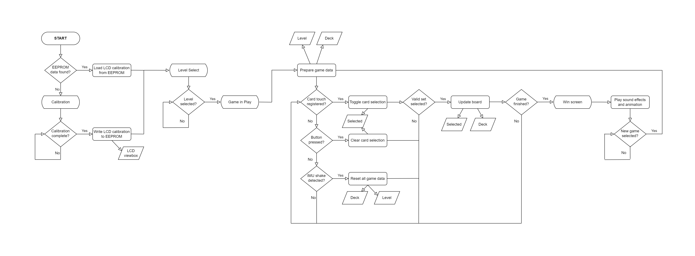
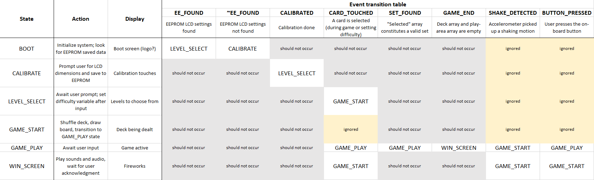

# Final Project State Documentation

## Projective Set on the STM32F429I-DISC1

General idea: an implementation of [Projective Set](https://en.wikipedia.org/wiki/Projective_Set_(game)) with multiple difficulty settings, touchscreen and console input, colorblindness accessibility modes, and shake-to-reset function using the on-board motion sensors. The state diagrams describe a more scaled-back version with what I'd consider the least viable product.

## Abstract State Machine

## SDL State Machine

## State Table

