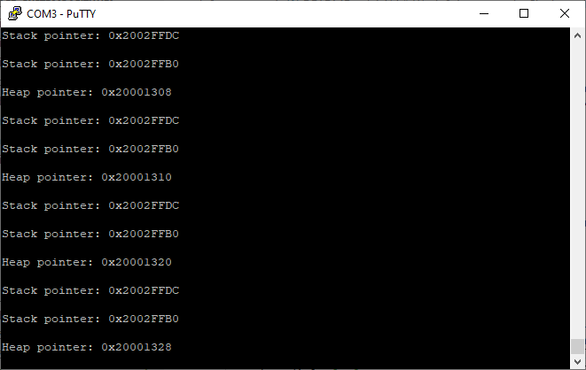

# Week 8 Assignment - Stacks and Heaps

## Print the current stack pointer

I used two different methods: initializing a new variable and immediately reading its address; or using an `__asm` block to read the `sp` (stack pointer) register directly.

```c
static void showStackPointerA(void) {
    volatile int newVariable;
    char dialog[40];
    sprintf(dialog, "Stack pointer: 0x%08X\r\n", (uintptr_t)(&newVariable));
    Serial_Message(dialog);
}

static void showStackPointerB(void) {
    volatile int registerValue;
    __asm volatile ("mov %0, sp" : "=r"(registerValue)); // Thank you to Daniel Fu for finding this on stack overflow: https://stackoverflow.com/questions/57032089/reading-stack-pointer-value-in-arm
    char dialog[40];
    sprintf(dialog, "Stack pointer: 0x%08X\r\n", (uintptr_t)(registerValue));
    Serial_Message(dialog);
}
```

## Print the current heap pointer

I used `malloc` to allocate one int's worth of dynamic memory and then point to its address.

```c
static void showHeapPointer(void) {
    volatile int *addMeToHeap;
    addMeToHeap = (int*)malloc(sizeof(int));
    char dialog[40];
    sprintf(dialog, "Heap pointer: 0x%08X\r\n", (uintptr_t)(addMeToHeap));
    Serial_Message(dialog);
}
```


(In this screenshot the board is idling waiting for user input, so nothing interesting happens to the stack).

## Printing out addresses to variables
Using the same approach that's in `showStackPointerA()`, I looked at addresses for static, nonstatic, initialized, uninitialized, global, and scoped variables. All the addresses appeared reasonable.